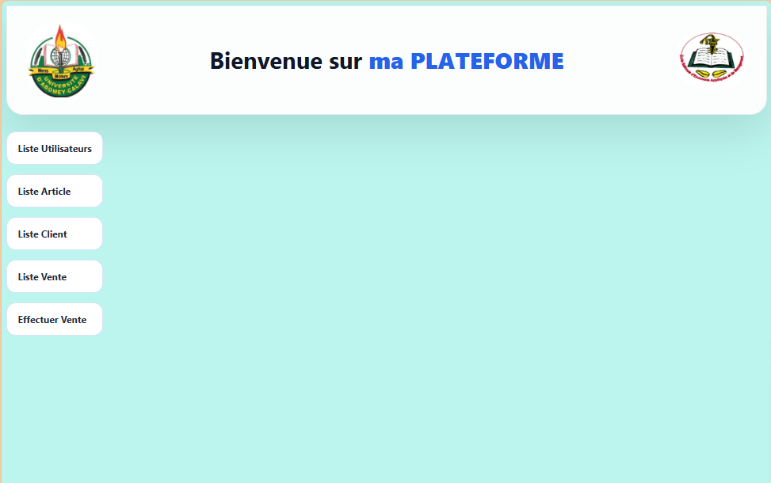
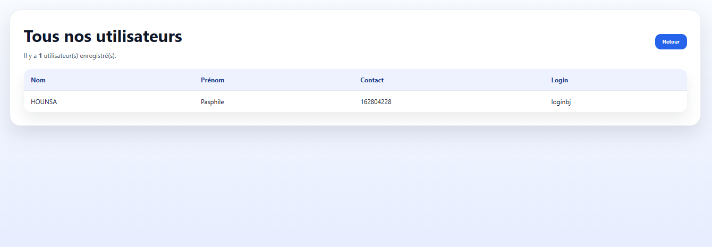
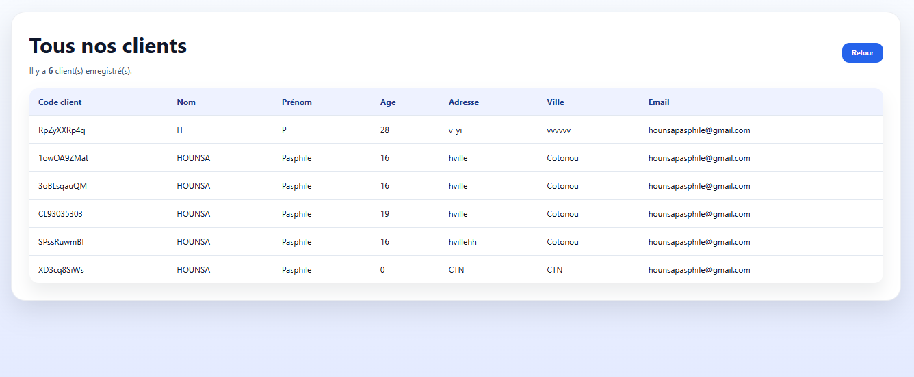
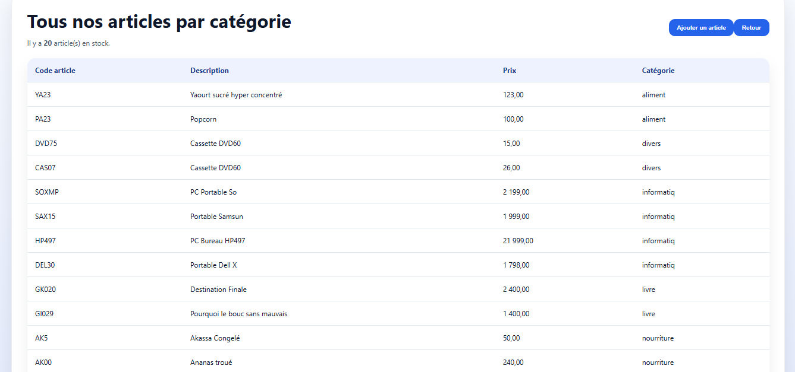
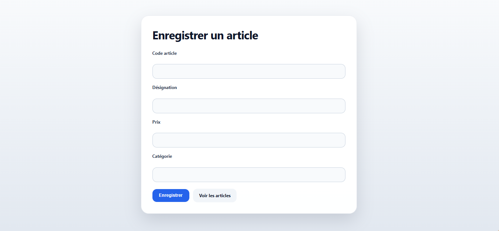
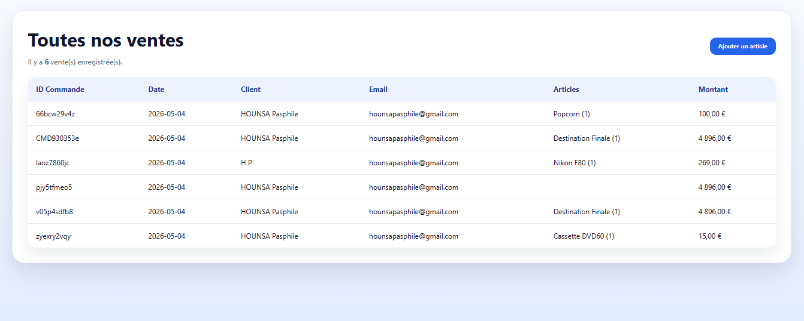
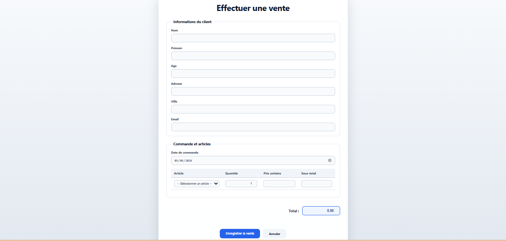

# Plateforme de gestion des ventes

Ce projet est une application PHP/MySQL développée pour gérer des ventes, des clients et des articles dans un environnement XAMPP.

## Fonctionnalités principales

- Saisie des informations client
- Enregistrement des ventes avec date et total
- Ajout de plusieurs articles par commande
- Enregistrement des articles commandés dans la table `contenir`
- Affichage des ventes et des utilisateurs
- Interface simple avec formulaires HTML et scripts PHP

## Prérequis

- XAMPP installé sur Windows
- Apache et MySQL démarrés
- Base de données MySQL disponible (`essaiebdd` dans la configuration actuelle)
- PHP 7.x ou PHP 8.x

## Installation

1. Copier le dossier du projet dans le répertoire `htdocs` de XAMPP, par exemple :
   - `C:\xampp\htdocs\php\exerciceEnr.aff`

2. Lancer Apache et MySQL depuis le panneau de contrôle XAMPP.

3. Importer la structure de la base de données dans phpMyAdmin.
   - Assurez-vous que les tables `client`, `commande`, `contenir`, `article` et les autres tables nécessaires existent.

4. Vérifier le fichier `connexion.php` pour s'assurer que les paramètres de connexion correspondent à votre serveur :
   - `localhost`
   - nom d'utilisateur MySQL
   - mot de passe MySQL
   - nom de la base de données

## Utilisation

- Ouvrir dans le navigateur : `http://localhost/php/exerciceEnr.aff/assets/php/acceuil.php`
- Aller dans "Effectuer Vente" pour saisir une commande client.
- Aller dans "Liste Vente" pour voir les commandes enregistrées.
- Aller dans "Liste Utilisateurs" pour afficher les comptes utilisateurs.

## Structure du projet

- `assets/php/` : scripts PHP principaux
  - `effectuerVente.php` : formulaire de saisie de vente
  - `traiterVente.php` : traitement des données de vente et insertion en base
  - `afficherVente.php` : affichage des ventes enregistrées
  - `afficherUtilisateur.php` : affichage des utilisateurs
  - `connexion.php` : connexion à la base de données
- `assets/styles/` : fichiers CSS d'interface
- `index.php` : page d'accueil principale
- `README.md` : documentation du projet

## Base de données

Le projet utilise une base MySQL dont les tables principales sont :

- `client` : informations des clients
- `commande` : enregistrements des commandes
- `contenir` : liaison entre commandes et articles
- `article` : catalogue des articles

